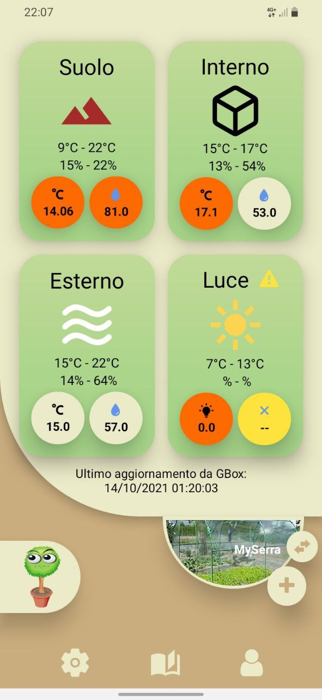

# microbotanyApp
> In fase di sviluppo

L'app permette di monitorare a distanza diverse caratteristiche ambientali all'interno di una serra indoor, come la temperatura, l'umidità, la quantità di luce e la qualità dell'aria. Utilizzando sensori collegati alla serra, l'app mostra i dati in tempo reale e fornisce notifiche in caso di condizioni anomale.

